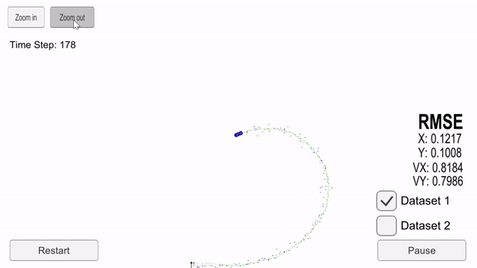

# Extended Kalman Filter Project
Self-Driving Car Engineer Nanodegree Program

* Lidar measurements are red circles.
* Radar measurements are blue circles with an arrow pointing in the direction of the observed angle
* Kalman estimation markers are green triangles.

# Introduction

* This project utilizes a kalman filter to estimate the state of a moving object of interest with noisy lidar and radar measurements. 

* This project involves the Term 2 Simulator which can be downloaded [here](https://github.com/udacity/self-driving-car-sim/releases).

* This repository includes two files that can be used to set up and install [uWebSocketIO](https://github.com/uWebSockets/uWebSockets) for either Linux or Mac systems. For windows you can use either Docker, VMware, or even [Windows 10 Bash on Ubuntu](https://www.howtogeek.com/249966/how-to-install-and-use-the-linux-bash-shell-on-windows-10/) to install uWebSocketIO. 

* Once the install for uWebSocketIO is complete, the main program can be built and run by doing the following from the project top directory.

## Basic Build Instructions

1. Clone this repo.
2. Make a build directory: `mkdir build && cd build`
3. Compile: `cmake .. && make` 
   * On windows, you may need to run: `cmake .. -G "Unix Makefiles" && make`
4. Run it: `./ExtendedKF `

## uWebSocketIO Starter Guide
This project involve using an open source package called `uWebSocketIO`. This package facilitates the same connection between the simulator and code that was used in the Term 1 Behavioral Cloning Project, but now with C++. The package does this by setting up a web socket server connection from the C++ program to the simulator, which acts as the host. In the project repository there are two scripts for installing uWebSocketIO - one for Linux and the other for macOS.

## Linux Installation:
From the project repository directory run the script: `install-ubuntu.sh`

## Mac Installation:
From the project repository directory run the script: `install-mac.sh`

## Windows Installation
[step by step guide](https://medium.com/@fzubair/udacity-carnd-term2-visual-studio-2015-17-setup-cca602e0b1cd)

One of the newest features to Windows 10 users is an Ubuntu Bash environment that works great and is easy to setup and use. Here is a nice [step by step guide](https://www.howtogeek.com/249966/how-to-install-and-use-the-linux-bash-shell-on-windows-10/) for setting up utilities.

 
